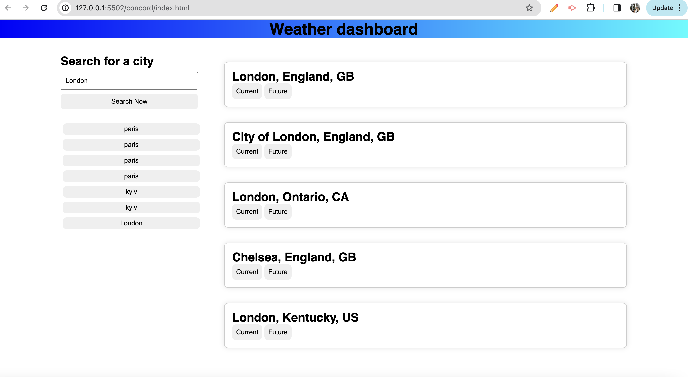

# concord

https://marydesh.github.io/concord/

* The weather dashboard app

* This app allows you to do the following:

- search for a certain city - after you enter the city name , you will be able to select from all the options available.
- after yo see the city you were looking for, you can select to show the current or a future weather forecast for it.
- when the current is selected, the wethaer for Today is shown for the selected city, when future is selcted, you will see the 5 day forecast for the city selected.
- your search history will be saved and cities you searched for will be shown under the 'search now' button, you can click on any of the searched  previously cities and select desired forecast again.

* In this project I got assiatnce from my tutor Doug - https://preply.com/en/tutor/3316660

* As well as inspiration form codeacademy JavaScript and API courses.

Thank you for reviewing this!

